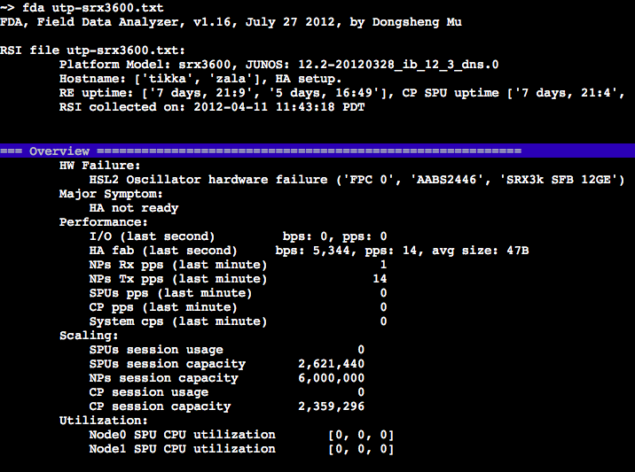
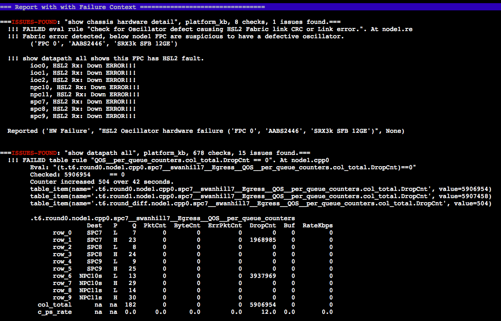
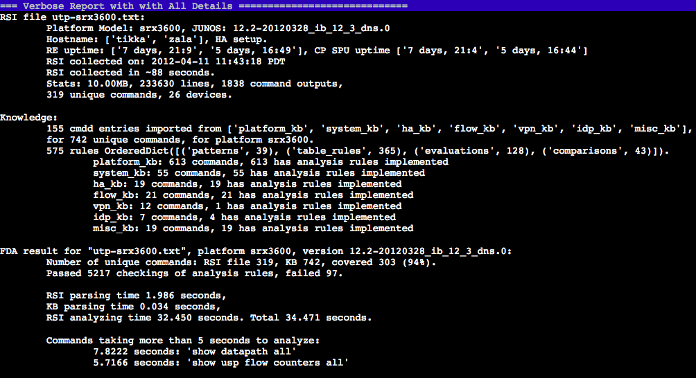

Field Data Analyzer is expert system framework designed for troubleshooting, which analyses vast amount of field escalation data with a set of analytical engines, based on an extensible knowledge base.

* * *

Along with the growth of software complicity, the cost of troubleshooting explores. Why?

First, duplicated troubleshooting are involved when a same software bug repeats in different releases or at different customer sites.

Second, before a root cause is identified, different software feature teams can be involved to triage some surface symptoms down to the root cause. Due to communication delay, insufficient hand-over info, and engineering bandwidth limit, an issue may take up to months to resolve.

Third, when insufficient raw data is collected to facilitate further troubleshooting, sometimes customers are asked to provide more data, or monitor, or even to reproduce the issue.

Fourth, for a distributed system, the amount of troubleshooting data (eg. commands output and logs) can be vast, easily go beyond 100MB, and the correlation among data can be tedious and computation heavy. Seeking through them manually is unbearable and unfruitful. 

Fifth, over the time, some code becomes legacy. When new use case exposes hidden issue in the area, developers are pulled out of new feature development to investigate, often this takes a knowledge refreshment or even relearn.

So on and so forth...

If we dissect this mess, the problems come from how raw data is collected, how the raw data is analyzed based on existing knowledge, and how the existing knowledge are accumulated, propagated, and updated.

FDA Field Data Analyzer is an automated tool with centralized and up-to-date knowledge, to analyze field data. 

I designed this FDA tool in early 2012. Initially I just wanted a tool to liberate myself from PR triaging efforts for my team, so I could focus on new developments. Triaging is merely a process to seek though data, apply existing knowledge, to infer direction of the root cause. Soon, I realized the much bigger impact this tool can bring. With a centralized knowledge base from various teams, PR hopping and delay can be avoided. With knowledge of known issues, duplicated effort for same issue can be avoided. With one-shot data collection, bank-and-forth collecting and reproducing can be avoided. With automation, the tool can sweep through vast data and point out anomalies which can be easily overlooked by human; and it can do the tedious and time consuming computation, so that developers are liberated to focus on more innovative stuff. 

So, it ended up as an troubleshooting expert system, with many features.

* Usage stats. Statistic of performance, scale, traffic load and pattern, resource utilization. Summary of in-use features and typical configuration.
* Data analysis with engines of various regex rules. Multi-dimensional tables for aggregation, data rate, correlation. Evaluation rule plug-in for code sniplets does customized logic analysis. 
* Easy JSON syntax to express troubleshooting knowledge rules and smart table parsing.
* Analysis of periodically collected data, for sparks, trends (such as slow leakage)
* Comparison with historical data, for major changes during the time span.
* Interactive mode to assist further human analysis.
* Data parsing from file, and collecting from live system.

The tool is well adopted by customer escalation and support teams. Besides post-failure analysis, it is proactively used for failure prevention, such as checking a initial deployment, performing regular maintenance and health monitoring, confirming network readiness for big events.

Sample report for the overview and failure details.

Here are the tool's performance stats for the relatively small data (10MB)

Demo of analysis of the changes in periodically collected data.
